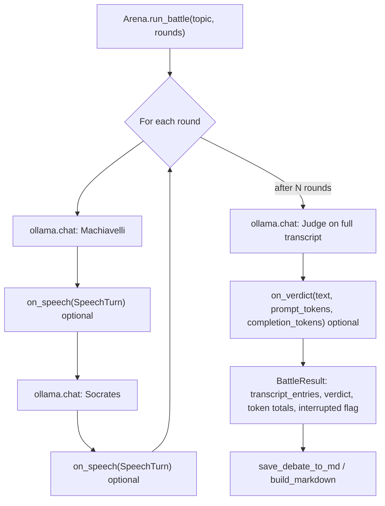

# Ollama Debate

**Version:** v1.0.0  
**Last updated:** May 2026

A Python script that runs a historical court debate between two [Ollama](https://ollama.com/) models (Socrates and Machiavelli) on a topic you choose, with a third model acting as the judge to deliver a verdict.

## Requirements

- [Ollama](https://ollama.com/) installed and running locally
- Python 3.x
- Python dependencies: **ollama**, **rich**, **PyYAML**, **pytest** (tests), **streamlit** ≥ 1.33 (web UI; uses `st.status` and related widgets)

## Setup

```bash
pip install -r requirements.txt
```

Make sure Ollama is running (e.g. start the Ollama app or run `ollama serve`). Default model names live in **`config.yaml`**; pull whatever you configure, for example:

```bash
ollama pull llama3.2:3b
```

## Usage

### Web UI (Streamlit)

Launch the browser-based interface:

```bash
streamlit run app.py
```

Use the sidebar to set the debate topic, number of rounds, and model names (defaults come from `config.yaml`). Optional **Stream model output** streams partial tokens into the main pane before each turn’s final card. Click **Start debate** to run. The main area shows progress, each reply with round and token hints, the verdict, session token totals, and **Download transcript (.md)** plus an optional **Markdown preview**. The debate is also saved under `debates/` when the run finishes (unless I/O fails; download still works from in-memory markdown).

### CLI

Run with defaults from `config.yaml`:

```bash
python3 cli.py
```

Override topic, rounds, or models via CLI (CLI takes precedence over config):

```bash
python3 cli.py --topic "Your debate topic" --rounds 3 --model_m llama3 --model_s qwen2.5-coder:7b --judge llama3.2:latest
```

- **--topic** — Debate question or statement (default from config).
- **--rounds** — Number of back-and-forth exchanges (default from config).
- **--model_m** — Ollama model for Machiavelli.
- **--model_s** — Ollama model for Socrates.
- **--judge** — Ollama model for the Judge.
- **--token-table** — After the run, print a Rich table of token usage per LLM call, plus a session total line.

You can also edit `config.yaml` to change default models, system prompts, and settings (e.g. `debates_dir`, `num_ctx`). The `debates/` folder is created automatically on first run when a debate is saved.

## Testing

Run the test suite with [pytest](https://pytest.org/):

```bash
pytest
```

Verbose:

```bash
pytest -v
```

Single file:

```bash
pytest tests/test_debate.py -v
pytest tests/test_main.py -v
```

Tests cover config loading, log filename formatting, argument parsing, and token handling; they use mocks so no real Ollama models are started.

## How it works

### Layers

| Layer | Role |
|--------|------|
| **`arena.py`** | Config helpers, `Arena.run_battle`, `SpeechTurn` / `BattleResult`, Markdown export (`build_markdown`, `save_debate_to_md`), `build_participants` / `llm_options_from_config`. |
| **`cli.py`** / **`app.py`** | Load config, ensure Ollama and models, construct `Arena`, pass optional **`on_speech`** / **`on_verdict`** callbacks for live output, then save (and in Streamlit, download) the transcript. |

### Debate loop (core)



1. **Character setup** — `build_participants` reads system prompts from `config.yaml` (with safe defaults in code). Each role has a fixed display name and icon.

2. **Debate flow** — For each round: Machiavelli replies to the current prompt, then Socrates replies to Machiavelli’s last speech. Separate chat histories are kept per character. After all rounds, the Judge receives the plain transcript and returns a verdict.

3. **Callbacks** — `on_speech` runs after every debater reply (not the judge). `on_verdict` runs once with the judge’s token counts for that call only; **`BattleResult`** aggregates prompt and completion tokens across **all** calls in the session. With **`Arena.run_battle(..., stream=True)`**, optional **`on_stream_begin(role)`** and **`on_stream_chunk(role, delta)`** receive Ollama stream chunks; the Streamlit app exposes this via a **Stream model output** checkbox (CLI keeps non-streaming output by default).

4. **Output** — CLI: Rich panels, optional round rules, **`--token-table`**. Streamlit: progress, status, optional streaming preview, per-reply and session token captions, file save, download button, markdown preview. Markdown logs under `debates/` (directory from `config.yaml`).

5. **Performance** — Tune `num_ctx`, `num_predict`, and `temperature` in `config.yaml` for your hardware.
