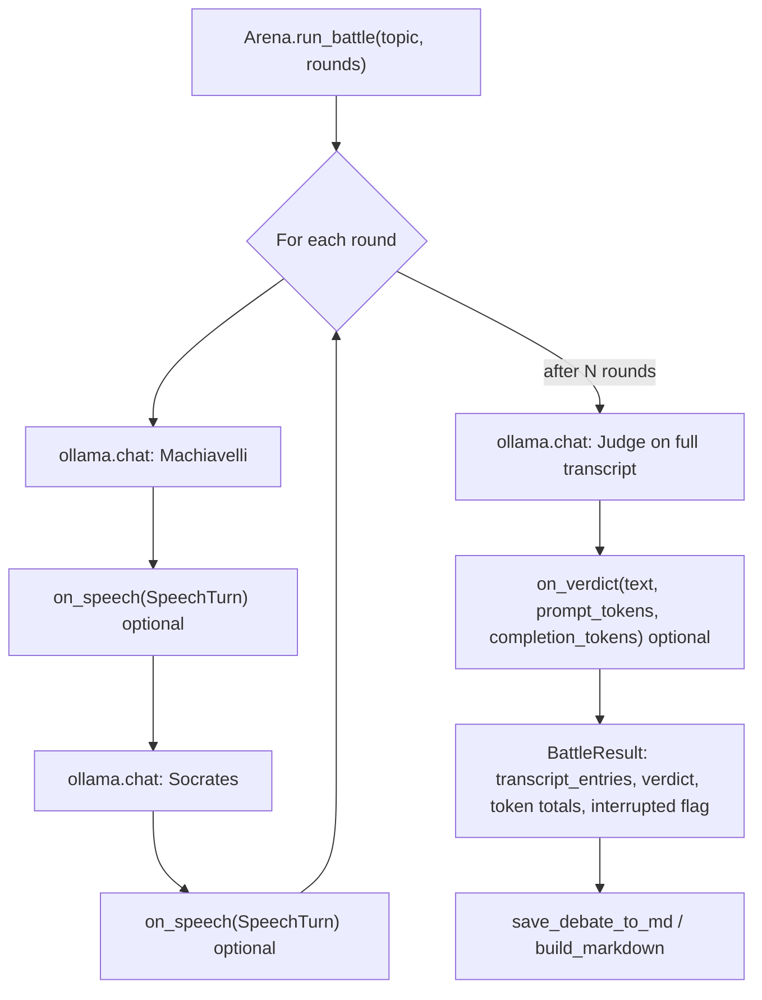

# Ollama Debate

**Version:** v1.0.0  
**Last updated:** May 2026

A small Python project: a **CLI** ([Rich](https://rich.readthedocs.io/)) and a **Streamlit** web UI run debates between two [Ollama](https://ollama.com/) models in the roles of Machiavelli and Socrates, with a third model as judge. Core logic lives in **`arena.py`** (no UI imports).

## Repository layout

| Path | Purpose |
|------|---------|
| **`arena.py`** | `Arena.run_battle`, `SpeechTurn` / `BattleResult`, `build_participants`, `llm_options_from_config`, Markdown export. |
| **`cli.py`** | Command-line entrypoint and Rich output. |
| **`app.py`** | Streamlit UI. |
| **`config.yaml`** | Default models, system prompts, `settings` (rounds, `debates_dir`, generation options). |
| **`.streamlit/config.toml`** | Streamlit theme (colors, font); loaded when you run `streamlit run` from this repo root. |
| **`tests/`** | Pytest tests (mocked; no live Ollama required). |
| **`debates/`** | Created when a run saves a transcript (Markdown). |

## Requirements

- [Ollama](https://ollama.com/) installed and running locally  
- **Python 3.9+** (commonly run on 3.11–3.13)  
- Dependencies from **`requirements.txt`**: **ollama**, **rich**, **PyYAML**, **pytest**, **streamlit** ≥ 1.33 (UI uses `st.status`, optional streaming, etc.)

## Setup

From the repository root:

```bash
cd /path/to/ollama-debate
python3 -m pip install -r requirements.txt
```

Optional virtual environment:

```bash
cd /path/to/ollama-debate
python3 -m venv .venv
.venv/bin/pip install -r requirements.txt
```

Start Ollama (desktop app or `ollama serve`). Pull the models listed in **`config.yaml`** (example for the stock repo file):

```bash
ollama pull qwen2.5-coder:3b
```

If you change model names in `config.yaml`, pull those tags instead.

---

## Commands (quick reference)

| Action | Command |
|--------|---------|
| Install dependencies | `python3 -m pip install -r requirements.txt` |
| Run **CLI** (defaults from `config.yaml`) | `python3 cli.py` |
| Run CLI with **venv** interpreter | `.venv/bin/python cli.py` |
| CLI **help** (all flags) | `python3 cli.py --help` |
| CLI with **topic / rounds / models** | `python3 cli.py --topic "Your topic" --rounds 3 --model_m MODEL --model_s MODEL --judge MODEL` |
| CLI with **per-call token table** after the run | `python3 cli.py --token-table` |
| Run **Streamlit** (run from repo root so theme loads) | `streamlit run app.py` |
| Streamlit with **venv** | `.venv/bin/streamlit run app.py` |
| Run **tests** | `python3 -m pytest tests/` |
| Tests **verbose** | `python3 -m pytest tests/ -v` |
| One test file | `python3 -m pytest tests/test_debate.py -v` |

On macOS/Linux, if `python` points to the right version, you can use `python` instead of `python3`.

---

## Usage (details)

### Web UI (Streamlit)

```bash
streamlit run app.py
```

Run this from the **repository root** so **`.streamlit/config.toml`** applies.

In the sidebar: topic, rounds, model names (defaults from `config.yaml`), optional **Stream model output** (Ollama `stream=True` with live chunks, then each turn as a card). **Start debate** runs the flow: progress bar, status line, transcript (outside the status widget so replies are not cleared), session token **metrics**, save to `debates/`, **Download transcript (.md)**, and **Markdown preview**.

### CLI

```bash
python3 cli.py
```

CLI arguments override `config.yaml` where applicable:

```bash
python3 cli.py --topic "Your debate topic" --rounds 3 --model_m qwen2.5-coder:3b --model_s qwen2.5-coder:3b --judge qwen2.5-coder:3b
```

| Flag | Meaning |
|------|---------|
| **`--topic`** | Debate question or statement (long default is built into `cli.py` if omitted). |
| **`--rounds`** | Number of Machiavelli↔Socrates rounds (default from `config.yaml` `settings.default_rounds`). |
| **`--model_m`** | Ollama model for Machiavelli. |
| **`--model_s`** | Ollama model for Socrates. |
| **`--judge`** | Ollama model for the judge. |
| **`--token-table`** | After the debate, print a Rich table of token usage per LLM call; a **session total** line is always printed at the end. |

During a run, the CLI prints **round separators**, Rich panels per reply (subtitle: round), **judge** section, then saves Markdown under the configured `debates_dir` (default `debates/`).

Edit **`config.yaml`** for default models, prompts, `debates_dir`, `num_ctx`, `num_predict`, `temperature`, etc.

---

## Testing

```bash
python3 -m pytest tests/
python3 -m pytest tests/ -v
python3 -m pytest tests/test_debate.py -v
python3 -m pytest tests/test_main.py -v
```

Tests cover config loading, slug/filename helpers, argument parsing, token helpers, **`SpeechTurn`** / streaming helper mocks, and related **`arena`** utilities. They do **not** start real Ollama models by default.

---

## How it works

### Layers

| Layer | Role |
|--------|------|
| **`arena.py`** | Config helpers, `Arena.run_battle`, `SpeechTurn` / `BattleResult`, Markdown export (`build_markdown`, `save_debate_to_md`), `build_participants` / `llm_options_from_config`, optional **streaming** chat aggregation. |
| **`cli.py`** / **`app.py`** | Load config, ensure Ollama and models, build `Arena`, pass **`on_speech`** / **`on_verdict`** (and in the app, optional **`on_stream_begin`** / **`on_stream_chunk`**) for live output, then save and (in Streamlit) offer download. |

### Debate loop (core)



1. **Character setup** — `build_participants` reads system prompts from `config.yaml` (with safe defaults in code). Each role has a fixed display name and icon.

2. **Debate flow** — For each round: Machiavelli replies, then Socrates replies to Machiavelli’s last speech. Separate chat histories are kept per character. After all rounds, the judge receives the plain transcript and returns a verdict.

3. **Callbacks** — `on_speech` runs after every debater reply (not the judge). `on_verdict` runs once with the judge’s token counts for that call only; **`BattleResult`** aggregates prompt and completion tokens across **all** calls in the session. With **`Arena.run_battle(..., stream=True)`**, optional **`on_stream_begin(role)`** and **`on_stream_chunk(role, delta)`** receive Ollama stream chunks; the Streamlit app exposes this via **Stream model output** (CLI uses non-streaming output).

4. **Output** — **CLI:** Rich panels, round rules, per-reply and judge token lines, optional **`--token-table`**, session total line, Markdown log. **Streamlit:** theme + layout CSS, session overview card, bordered speech/verdict blocks, progress + status, optional streaming, metrics, save + download + preview. Logs go under **`debates/`** (or `settings.debates_dir` in `config.yaml`).

5. **Performance** — Tune `num_ctx`, `num_predict`, and `temperature` in `config.yaml` for your hardware.
